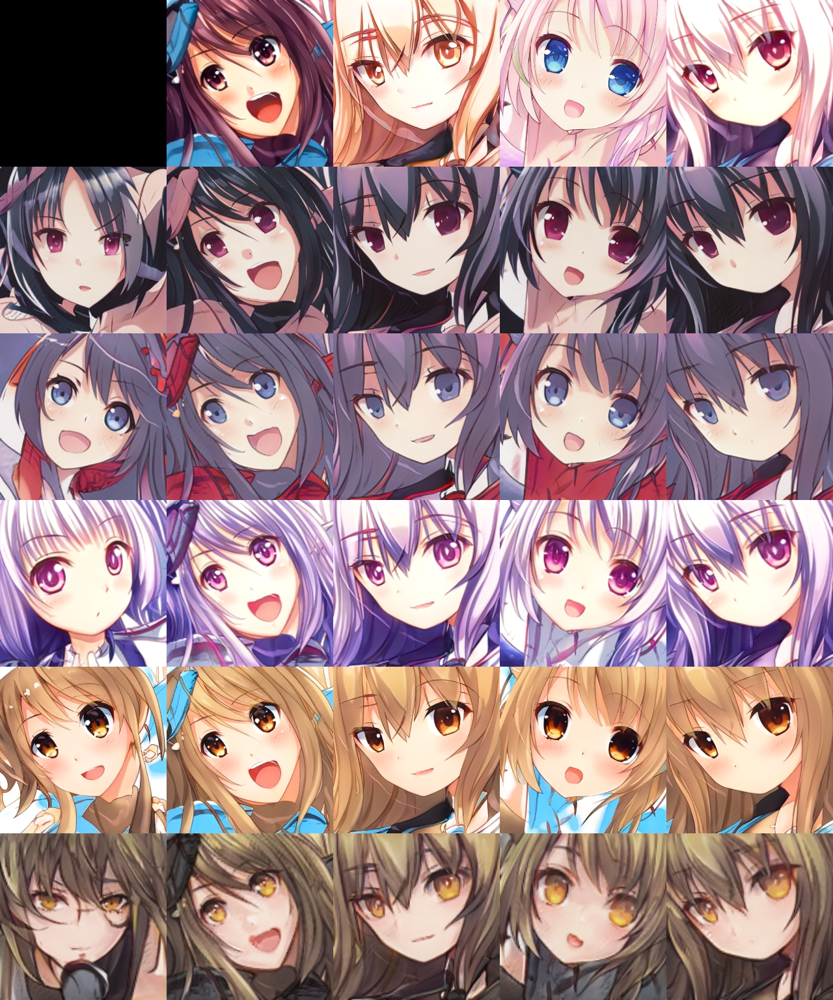
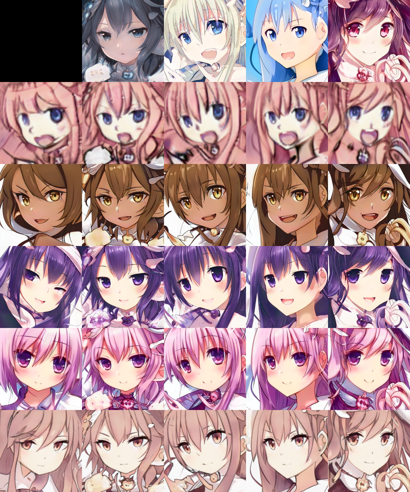
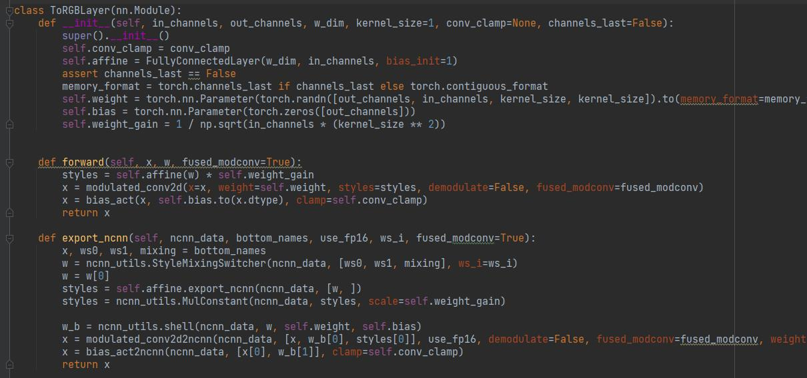
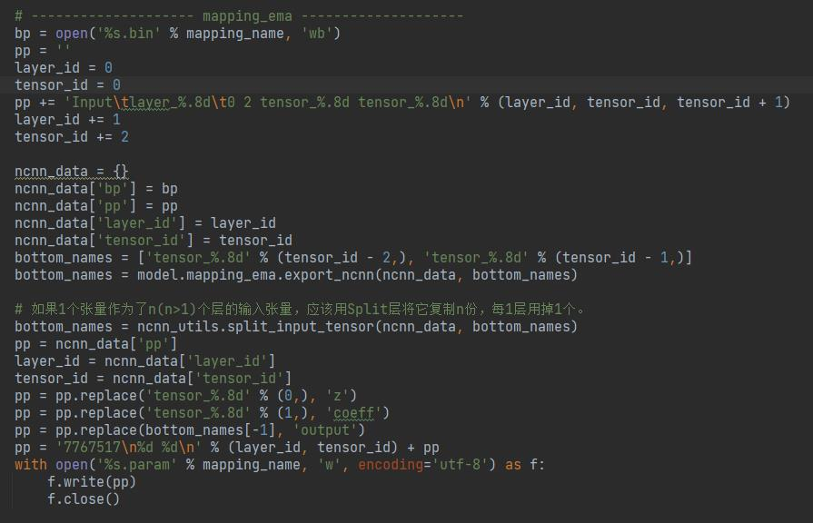
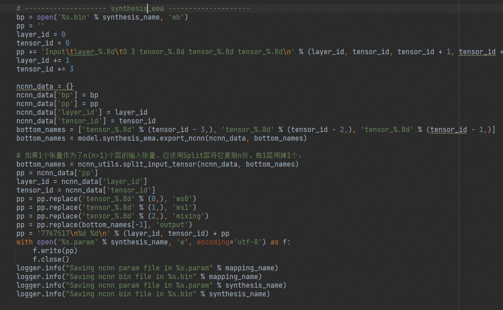

简体中文 | [English](README_StyleGAN_en.md)

# 全网第一个！stylegan2-ada和stylegan3的pytorch实现二合一！支持导出ncnn！

## 概述

大家好！今天给大家安利一个宝藏仓库[miemieGAN](https://github.com/miemie2013/miemieGAN)  （和[ncnn](https://github.com/miemie2013/ncnn)）， 基于YOLOX的代码进行二次开发，该仓库集合了stylegan2-ada和stylegan3两个算法pytorch实现二合一，其中的stylegan2-ada算法支持导出ncnn，<font color=#bf1002><b>据我所知这应该是全网第一个成功把stylegan导出到ncnn的项目</b></font>。stylegan2-ada的前向传播复杂，虽然定义了很多自定义层，但是forward()方法里却调用了很多自定义函数，有“函数式编程”那味，使得导出非常地困难。一开始咩酱也不理解为什么stylegan2-ada不直接使用torch.nn.Conv2d来组网，而是经过层层封装后最后调用了F.conv2d()。在我仔细看了它的源码之后，才明白作者Tero Karras的良苦用心，他真的不是想把代码写得让人看不懂的。因为卷积层的权重weight需要和styles风格向量结合（相乘），来一步一步合成特定风格图像，所以不使用torch.nn.Conv2d，因为不够灵活。<font color=#bf1002><b>stylegan真的是一件艺术品！</b></font>

## 为什么要做这个项目？

当然是因为要学习stylegan呀！虽然看代码也行，但没有自己再写一遍印象深刻。stylegan一直都是最先进的图像生成器，每一代一出生总能给我们带来惊喜，就很有学习价值。虽然现在名为扩散模型的模型生成效果比stylegan好，但其算力需求也大，不是我们这些贫民玩家玩得起的。我个人很喜欢作者在stylegan2-ada-pytorch仓库README中的一句话“This repository is a faithful reimplementation of StyleGAN2-ADA in PyTorch, focusing on correctness, performance, and compatibility.”。而这句话，也是我要对你们说的，miemieGAN里的stylegan2-ada、stylegan3跟随官方原版仓库，咩酱对齐了单机单卡、单机多卡下本仓库与原版仓库参数更新情况，是完全一致的（通过一些手段屏蔽了随机数的影响），请放心使用。stylegan3官方仓库没有使用DDP，所以我参考了stylegan2-ada-pytorch的代码。由于miemieGAN基于YOLOX，所以天生也支持多机多卡训练。

## 下载预训练模型

链接：https://pan.baidu.com/s/1g3DCFU4riVLRil2x6Zdwjw 
提取码：a8og 

其中StyleGANv2ADA_outputs.zip为读取styleganv2ada_512_afhqcat.pth迁移学习一个动漫头像数据集（地址https://aistudio.baidu.com/aistudio/datasetdetail/110820 ）获得的权重、日志、中间生成结果；StyleGANv3_outputs.zip为从头学习这个动漫头像数据集获得的权重、日志、中间生成结果。

## 训练

大体命令格式如下：
```
python tools/train.py -f exps/xxx/{config_file}.py -d {device_count} -b {total_batch_size} -eb {total_test_batch_size} -c xxx.pth
```

比如，读取styleganv2ada_512_afhqcat.pth迁移学习动漫头像数据集可以输入（单机双卡）：
```
CUDA_VISIBLE_DEVICES=0,1
nohup python tools/train.py -f exps/styleganv2ada/styleganv2ada_256_custom.py -d 2 -b 8 -eb 2 -c styleganv2ada_512_afhqcat.pth     > stylegan2ada.log 2>&1 &
```

计算某个模型的FID，可以输入以下命令
```
python tools/calc_metrics.py -f exps/styleganv2ada/styleganv2ada_256_custom.py -c StyleGANv2ADA_outputs/styleganv2ada_256_custom/65.pth -b 2 -n 50000 --inceptionv3_path inception-2015-12-05.pth --device gpu
```
计算FID目前仅支持单卡。65.pth FID约为8.209035

恢复训练时，修改-c，加上--resume。比如读取上述65.pth恢复训练，可以输入
```
CUDA_VISIBLE_DEVICES=0,1
nohup python tools/train.py -f exps/styleganv2ada/styleganv2ada_256_custom.py -d 2 -b 8 -eb 2 -c StyleGANv2ADA_outputs/styleganv2ada_256_custom/65.pth --resume     > stylegan2ada.log 2>&1 &
```


再比如，stylegan3从头训练动漫头像数据集可以输入（单机双卡，styleganv3_s是自己新增的配置，减小了channel_base、channel_max，因为stylegan3太吃显存了！）：
```
CUDA_VISIBLE_DEVICES=0,1
nohup python tools/train.py -f exps/styleganv3/styleganv3_s_256_custom.py -d 2 -b 8 -eb 2     > stylegan3.log 2>&1 &
```

计算某个模型的FID，可以输入以下命令
```
python tools/calc_metrics.py -f exps/styleganv3/styleganv3_s_256_custom.py -c StyleGANv3_outputs/styleganv3_s_256_custom/77.pth -b 2 -n 50000 --inceptionv3_path inception-2015-12-05.pth --device gpu
```
计算FID目前仅支持单卡。77.pth FID约为8.085018

exp配置文件的self.dataroot指向数据集图片文件夹，修改它就能训练新的图片了！

(翻阅readme_styleganv2ada.txt和readme_styleganv3.txt复制粘贴更多命令。)

## 生成图片

大体命令格式如下：
```
python tools/demo.py image -f exps/xxx/{config_file}.py -c xxx.pth --seeds {seed0},{seed1},... --save_result --device gpu
```

比如
```
python tools/demo.py image -f exps/styleganv2ada/styleganv2ada_256_custom.py -c StyleGANv2ADA_outputs/styleganv2ada_256_custom/65.pth --seeds 85,100,75,458,1500 --save_result --device gpu
```
这句，读取了65.pth，用了5个随机种子85,100,75,458,1500来生成图像。另外，你还可以加额外的参数 --noise_mode、--trunc等。--noise_mode支持'random', 'const', 'none'，决定了SynthesisLayer中往特征图x中加入噪声noise，'random'表示预测时加入随机噪声，'const'表示预测时加入固定的噪声（即每次预测都是加相同的噪声），'none'表示不加入随机噪声。--trunc则是填入1个0.0到1.0之间的数值，默认是1.0。StyleGAN的MappingNetwork负责把随机种子得到的向量z转成潜在空间的向量w，MappingNetwork在训练时还会以滑动平均的方式更新一个统计量w_avg，类似于BN层的均值和方差。w_avg即潜在空间的向量w的平均值。而--trunc这个参数则表示MappingNetwork输出的w和w_avg做一个百分比混合作为最后输出的潜在空间的向量。代码如下:
```
        # Apply truncation.
        if truncation_psi != 1:
            assert self.w_avg_beta is not None
            if self.num_ws is None or truncation_cutoff is None:
                x = self.w_avg.lerp(x, truncation_psi)    # miemie2013: that is, x = (1. - truncation_psi) * self.w_avg + truncation_psi * x
```
即，最后的x，self.w_avg占的比例是(1. - truncation_psi)，原x占的比例是truncation_psi。如果--trunc是1，那么最后的x就是原x；如果--trunc是0，那么最后的x就是w_avg。

所以，为什么不直接看看w_avg妈妈的真颜呢？好的，马上行动！输入
```
python tools/demo.py image -f exps/styleganv2ada/styleganv2ada_256_custom.py -c StyleGANv2ADA_outputs/styleganv2ada_256_custom/65.pth --seeds 85,100,75,458,1500 --noise_mode const --trunc 0.0 --save_result --device gpu
```
你会得到5张一样的图片，因为都是w_avg妈妈变来的。你知道w_avg妈妈有多好看吗！！！她是整个噪声空间经过MappingNetwork之后得到的w的平均值，倾国倾城都不能形容她的美貌！


好看吧！每个模型都有w_avg妈妈，设置--trunc 0.0 就能请出w_avg妈妈。比如对于stylegan3，您可以输入：

```
python tools/demo.py image -f exps/styleganv3/styleganv3_s_256_custom.py -c StyleGANv3_outputs/styleganv3_s_256_custom/77.pth --seeds 85,100,75,458,1500 --noise_mode const --trunc 0.0 --save_result --device gpu
```
请出w_avg妈妈。

<font color=#bf1002><b>--trunc越小，生成的图像越像w_avg妈妈；--trunc越大，生成的图像越像原来的随机种子。</b></font>

(翻阅readme_styleganv2ada.txt和readme_styleganv3.txt复制粘贴更多命令。)

## style_mixing

比如，
```
python tools/demo.py style_mixing -f exps/styleganv2ada/styleganv2ada_256_custom.py -c StyleGANv2ADA_outputs/styleganv2ada_256_custom/65.pth --row_seeds 85,100,75,458,1500 --col_seeds 55,821,1789,293 --col_styles 0,1,2,3,4,5,6 --save_result --device gpu
```
在这条命令中，col_styles 0,1,2,3,4,5,6表示的是row_seeds生成的潜在因子ws的0,1,2,3,4,5,6个被替换成了col_seeds的0,1,2,3,4,5,6个，
即col_seeds提供了动作姿态，row_seeds提供了皮肤（可以看看readme_styleganv2ada_note.txt算法阅读笔记）。排在前面的潜在因子指挥生成低分辨率的图片(决定最终图像的动作姿态)，排在后面的潜在因子指挥生成高分辨率的图片(决定最终图像的皮肤)。如图：




stylegan3也是支持style_mixing的，比如输入
```
python tools/demo.py style_mixing -f exps/styleganv3/styleganv3_s_256_custom.py -c StyleGANv3_outputs/styleganv3_s_256_custom/77.pth --seeds 85,100,75,458,1500 --col_seeds 55,821,1789,293 --col_styles 0,1,2,3,4,5,6 --save_result --device gpu
```
你将得到：



真·百变小樱！小樱的皮肤都没有stylegan多！

(翻阅readme_styleganv2ada.txt和readme_styleganv3.txt复制粘贴更多命令。)

## 图像渐变（生成视频）

比如，
```
python tools/demo.py A2B -f exps/styleganv2ada/styleganv2ada_256_custom.py -c StyleGANv2ADA_outputs/styleganv2ada_256_custom/65.pth --seeds 85,100,75,458,1500 --frames 120 --video_fps 30 --save_result --device gpu
```
这条命令会生成1个视频，随机种子85依次渐变成随机种子100,75,458,1500，两个随机种子直接的渐变帧数是120帧，生成的视频是30帧。你可以用A2B制作“艺术品”，比如输入这条命令，

```
python tools/demo.py A2B -f exps/styleganv2ada/styleganv2ada_1024_metfaces.py -c styleganv2ada_1024_metfaces.pth --seeds 0_76 --frames 120 --video_fps 30 --save_result --device gpu
```
给周杰伦新歌《最伟大的作品》画画制作MV!

<iframe src="//player.bilibili.com/player.html?bvid=BV1HL411w7aY" scrolling="no" border="0" frameborder="no" framespacing="0" allowfullscreen="true" style="width:512px;height:512px;"> </iframe>

 --seeds 0_76表示的是从0到76这77个随机种子渐变。miemieGAN支持输入这样的随机种子表示。


A2B还有更多玩法（更多命令行参数），比如
```
python tools/demo.py A2B -f exps/styleganv2ada/styleganv2ada_256_custom.py -c StyleGANv2ADA_outputs/styleganv2ada_256_custom/65.pth --seeds 85,100,75,458,1500 --A2B_mixing_seed 458 --col_styles 0,1,2,3,4,5,6 --frames 120 --video_fps 30 --save_result --device gpu
```
--A2B_mixing_seed 458 表示这个随机种子生成的ws在每一帧和每一帧的ws进行style_mixing， --col_styles 0,1,2,3,4,5,6表示A2B_mixing_seed生成的ws提供了动作姿态，每一帧的ws提供了皮肤； --col_styles 7,8,9,10,11,12,13表示A2B_mixing_seed生成的ws提供了皮肤，每一帧的ws提供了动作姿态；--A2B_mixing_seed w_avg 表示直接用w_avg妈妈进行style_mixing。

比如(w_avg妈妈提供动作姿态！！！神仙颜值，什么发色瞳色都能驾驭！！！)
```
python tools/demo.py A2B -f exps/styleganv2ada/styleganv2ada_256_custom.py -c StyleGANv2ADA_outputs/styleganv2ada_256_custom/65.pth --seeds 85,100,75,458,1500 --A2B_mixing_seed w_avg --col_styles 0,1,2,3,4,5,6 --frames 120 --video_fps 30 --save_result --device gpu
```

比如(w_avg妈妈提供皮肤！！！)
```
python tools/demo.py A2B -f exps/styleganv2ada/styleganv2ada_256_custom.py -c StyleGANv2ADA_outputs/styleganv2ada_256_custom/65.pth --seeds 85,100,75,458,1500 --A2B_mixing_seed w_avg --col_styles 7,8,9,10,11,12,13 --frames 120 --video_fps 30 --save_result --device gpu
```

比如(更低的分辨率使用了w_avg妈妈的潜在因子，人物更像w_avg妈妈！！！)
```
python tools/demo.py A2B -f exps/styleganv2ada/styleganv2ada_256_custom.py -c StyleGANv2ADA_outputs/styleganv2ada_256_custom/65.pth --seeds 85,100,75,458,1500 --A2B_mixing_seed w_avg --col_styles 2,3,4,5,6,7,8,9,10,11,12,13 --frames 120 --video_fps 30 --save_result --device gpu
```

stylegan3也是支持上面这些玩法。而且，stylegan3生成的视频（afhq或ffhq或metfaces数据集）解决了“屏幕粘毛”的问题，但是stylegan2ada有“屏幕粘毛”的视觉观感。

(翻阅readme_styleganv2ada.txt和readme_styleganv3.txt复制粘贴更多命令。)


## 获取真实图片的潜在因子ws（真实图片投影到潜在空间）

MappingNetwork把随机种子变成了潜在空间的向量w。那有什么办法将真实图片变成潜在空间的向量w，让真实图片也有机会参加style_mixing的玩法？作者给出的是基于优化的方法。比如

```
python tools/demo.py projector -f exps/styleganv2ada/styleganv2ada_256_custom.py -c StyleGANv2ADA_outputs/styleganv2ada_256_custom/65.pth --outdir out --target_fname ./target_imgs/xy.jpg --save_result --device gpu
```
从w_avg妈妈开始，渐变成--target_fname指定的图片（即小樱），得到小樱图片对应的向量w，结果放在out文件夹。但是我感觉效果不太行(我已经是照搬作者代码了)。

(翻阅readme_styleganv2ada.txt和readme_styleganv3.txt复制粘贴更多命令。)


## 如何导出ncnn?

全网首发！据我所知这是全网第一个实现stylegan导出ncnn的项目！导出ncnn有多难？给你看看stylegan部分层的网络结构：



你看，ToRGBLayer里就定义了1个全连接层，全连接层用于将w向量转styles向量，还定义了卷积层用到的weight和bias。但是weight和bias并没有直接作用于x，因为weight还需要和styles向量结合等一系列操作之后，最后才用于卷积层。如此复杂的前向逻辑，使得导出ncnn非常困难！ToRGBLayer非常“不务正业”，虽然定义了weight和bias，却没有马上使用，就好像ToRGBLayer只是一个寄存这两个权重的一具<font color=#bf1002><b>空壳</b></font>，不管weight和bias的前向逻辑，它们的前向逻辑归外部方法modulated_conv2d()和bias_act()管。ncnn里好像没有这种“不务正业”的层，所以咩酱写了一个自定义层Shell，Shell只负责寄存权重，它不管前向逻辑，<font color=#bf1002><b>权重你爱怎么用怎么用</b></font>。Shell的代码如下：

```
class Shell : public ncnn::Layer
{
public:
    Shell()
    {
        // miemie2013: if num of input tensors > 1 or num of output tensors > 1, you must set one_blob_only = false
        // And ncnn will use forward(const std::vector<Mat>& bottom_blobs, std::vector<Mat>& top_blobs, const Option& opt) method
        // or forward_inplace(std::vector<Mat>& bottom_top_blobs, const Option& opt) method
        one_blob_only = false;
        support_inplace = false;
    }

    virtual int load_param(const ncnn::ParamDict& pd)
    {
        C = pd.get(2, 1);
        D = pd.get(11, 1);
        H = pd.get(1, 1);
        W = pd.get(0, 1);
        target_dims = pd.get(3, 4);
        bias_term = pd.get(5, 0);
        weight_data_size = pd.get(6, 0);
        return 0;
    }

    virtual int load_model(const ncnn::ModelBin& mb)
    {
        weight_data = mb.load(weight_data_size, 0);
        if (weight_data.empty())
            return -100;

        if (bias_term)
        {
            bias_data = mb.load(C, 1);
            if (bias_data.empty())
                return -100;
        }
        return 0;
    }

    virtual int forward(const std::vector<ncnn::Mat>& bottom_blobs, std::vector<ncnn::Mat>& top_blobs, const ncnn::Option& opt) const
    {
        // refer to Split layer.
        const ncnn::Mat& bottom_blob = bottom_blobs[0];
        const size_t elemsize = bottom_blob.elemsize;

        top_blobs[0].create(W, H, D, C, elemsize, opt.blob_allocator);
        if (top_blobs[0].empty())
            return -100;
        top_blobs[0] = weight_data;
//        print_shape(top_blobs[0], "top_blobs[0]");


        ncnn::Layer* op = ncnn::create_layer(ncnn::LayerType::Reshape);

        // set param
        ncnn::ParamDict pd;
        pd.set(2, C);
        pd.set(11, D);
        pd.set(1, H);
        pd.set(0, W);
        op->load_param(pd);
        op->create_pipeline(opt);
        op->forward(top_blobs[0], top_blobs[0], opt);
        op->destroy_pipeline(opt);
        delete op;

        top_blobs[0].dims = target_dims;

        if (bias_term)
        {
            top_blobs[1] = bias_data;
        }
//        print_shape(top_blobs[0], "top_blobs[0]");
//        print_shape(bias_data, "bias_data");
        return 0;
    }
public:
    // param
    int C;
    int D;
    int H;
    int W;
    int target_dims;
    int bias_term;

    int weight_data_size;

    // model
    ncnn::Mat weight_data;
    ncnn::Mat bias_data;
};
```

Shell层最多寄存2个权重weight和bias，weight最多支持4维，bias只支持1维；当bias_term设为0时，只寄存1个权重weight。它的前向传播为直接返回weight和bias。这是最干净的层了，什么都不做，就只寄存权重。另外，受启发于[全网首发！ncnn实现PPYOLOE算法，优雅导出不让中间商赚差价！](https://zhuanlan.zhihu.com/p/532518260) ,咩酱封装了1个工具ncnn_utils，<font color=#bf1002><b>它支持写一次前向传播就能导出ncnn使用的*.bin和*.param文件，它支持用python代码给ncnn组网！</b></font>你只需给每个pytorch层增加1个export_ncnn()方法，export_ncnn()方法几乎只要照抄farward()方法就能把模型导出到ncnn。是不是很牛x？你几乎只要照着farward()方法写，在export_ncnn()方法里用ncnn_utils的api写一次前向传播就能把pytorch模型导出到ncnn。当然，上面的ToRGBLayer额外加了点东西，它加了一个层StyleMixingSwitcher，让ncnn版stylegan支持style_mixing！

既然导出ncnn这么困难，那么咩酱是怎么导出的呢？我们从头开始看!



代码见tools/demo.py，对于mapping网络，首先定义了2个输入，1个是随机种子得到的z，1个是coeff，即上文的--trunc，即最后输出的w原w占比coeff，w_avg妈妈占比(1 - coeff)。之后调用了mapping_ema.export_ncnn(ncnn_data, bottom_names)，我们看看它的代码：

```
def normalize_2nd_moment(x, dim=1, eps=1e-8):
    return x * (x.square().mean(dim=dim, keepdim=True) + eps).rsqrt()

def normalize_2nd_moment2ncnn(ncnn_data, x, dim=1, eps=1e-8):
    temp = ncnn_utils.square(ncnn_data, x)
    temp = ncnn_utils.reduction(ncnn_data, temp, op='ReduceMean', input_dims=2, dims=(dim, ), keepdim=True)
    temp = ncnn_utils.rsqrt(ncnn_data, temp, eps=eps)

    # 最后是逐元素相乘
    bottom_names = [x[0], temp[0]]
    bottom_names = ncnn_utils.binaryOp(ncnn_data, bottom_names, op='Mul')
    return bottom_names

class FullyConnectedLayer(nn.Module):
    def __init__(self, ...):
        super().__init__()
        self.activation = activation
        self.weight = torch.nn.Parameter(torch.randn([out_features, in_features]) / lr_multiplier)
        self.bias = torch.nn.Parameter(torch.full([out_features], np.float32(bias_init))) if bias else None
        self.weight_gain = lr_multiplier / np.sqrt(in_features)
        self.bias_gain = lr_multiplier

    def forward(self, x):
        w = self.weight.to(x.dtype) * self.weight_gain
        b = self.bias
        if b is not None:
            b = b.to(x.dtype)
            if self.bias_gain != 1:
                b = b * self.bias_gain

        if self.activation == 'linear' and b is not None:
            x = torch.addmm(b.unsqueeze(0), x, w.t())
        else:
            x = x.matmul(w.t())
            x = bias_act(x, b, act=self.activation)
        return x

    def export_ncnn(self, ncnn_data, bottom_names):
        x_dtype = torch.float32
        w = self.weight.to(x_dtype) * self.weight_gain
        b = self.bias
        if b is not None:
            b = b.to(x_dtype)
            if self.bias_gain != 1:
                b = b * self.bias_gain

        w_b = ncnn_utils.shell(ncnn_data, bottom_names, w.unsqueeze(2).unsqueeze(3), b)

        if self.activation == 'linear' and b is not None:
            w_name = w_b[0]
            b_name = w_b[1]
            # 传入Fmatmul层的w的形状是[out_C, in_C, 1, 1] 所以不要使用
            # wt_names = ncnn_utils.really_permute(ncnn_data, w_name, perm=(1, 0, 2, 3))  # [CD11] -> [DC11]   这句代码
            bottom_names = ncnn_utils.Fmatmul(ncnn_data, [bottom_names[0], w_name, b_name], w.shape)
        else:
            w_name = w_b[0]
            b_name = w_b[1]
            # 传入Fmatmul层的w的形状是[out_C, in_C, 1, 1] 所以不要使用
            # wt_names = ncnn_utils.really_permute(ncnn_data, w_name, perm=(1, 0, 2, 3))  # [CD11] -> [DC11]   这句代码
            bottom_names = ncnn_utils.Fmatmul(ncnn_data, [bottom_names[0], w_name], w.shape)
            bottom_names = bias_act2ncnn(ncnn_data, [bottom_names[0], b_name], act=self.activation)
        return bottom_names

class StyleGANv2ADA_MappingNetwork(nn.Module):
    def __init__(self, ...):
        super().__init__()
        ...
        for idx in range(num_layers):
            in_features = features_list[idx]
            out_features = features_list[idx + 1]
            layer = FullyConnectedLayer(in_features, out_features, activation=activation, lr_multiplier=lr_multiplier)
            setattr(self, f'fc{idx}', layer)

        if num_ws is not None and w_avg_beta is not None:
            self.register_buffer('w_avg', torch.zeros([w_dim]))

    def forward(self, z, c, truncation_psi=1, truncation_cutoff=None, skip_w_avg_update=False):
        # Embed, normalize, and concat inputs.
        x = None
        if self.z_dim > 0:
            x = normalize_2nd_moment(z.to(torch.float32))
        if self.c_dim > 0:
            y = normalize_2nd_moment(self.embed(c.to(torch.float32)))
            x = torch.cat([x, y], dim=1) if x is not None else y

        # Main layers.
        for idx in range(self.num_layers):
            layer = getattr(self, f'fc{idx}')
            x = layer(x)

        # Update moving average of W.
        if self.w_avg_beta is not None and self.training and not skip_w_avg_update:
            self.w_avg.copy_(x.detach().mean(dim=0).lerp(self.w_avg, self.w_avg_beta))

        # Broadcast.
        if self.num_ws is not None:
            x = x.unsqueeze(1).repeat([1, self.num_ws, 1])

        # Apply truncation.
        if truncation_psi != 1:
            assert self.w_avg_beta is not None
            if self.num_ws is None or truncation_cutoff is None:
                x = self.w_avg.lerp(x, truncation_psi)
            else:
                x[:, :truncation_cutoff] = self.w_avg.lerp(x[:, :truncation_cutoff], truncation_psi)
        return x

    def export_ncnn(self, ncnn_data, bottom_names, truncation_psi=1, truncation_cutoff=None, skip_w_avg_update=False):
        x = None
        z, coeff = bottom_names
        if self.z_dim > 0:
            x = normalize_2nd_moment2ncnn(ncnn_data, [z, ])
        if self.c_dim > 0:
            raise NotImplementedError("not implemented.")

        w_avg_names = ncnn_utils.shell(ncnn_data, x, self.w_avg.unsqueeze(0).unsqueeze(0).unsqueeze(0), None, ncnn_weight_dims=1)  # [111W] 形状(ncnn)

        # Main layers.
        for idx in range(self.num_layers):
            layer = getattr(self, f'fc{idx}')
            x = layer.export_ncnn(ncnn_data, x)

        x = ncnn_utils.lerp(ncnn_data, w_avg_names + x + [coeff, ])
        return x
```

MappingNetwork的前向很简单，先对z进行归一化normalize_2nd_moment()，再经过num_layers个全连接层。我写了个方法normalize_2nd_moment2ncnn(ncnn_data, x, dim=1, eps=1e-8)将方法normalize_2nd_moment()导出到ncnn。由于MappingNetwork寄存了w_avg妈妈，所以用ncnn_utils.shell()在ncnn中建立1个Shell层，寄存w_avg妈妈（注：用register_buffer()登记的变量不会被优化器更新，但是会出现在模型的state_dict里，类似BN层的均值和方差。）。然后，我给FullyConnectedLayer层也加了export_ncnn()方法，它的导出由它自己负责。咩酱写export_ncnn()时没有100%照搬forward()，比如，我没有写repeat()，因为都是同一个w，就没有写。最后，用ncnn_utils.lerp()层终结了MappingNetwork罪恶的一生，即全连接层输出的w和w_avg妈妈插值。

然后看看SynthesisNetwork是怎么导出的！



代码见tools/demo.py，对于synthesis网络，首先定义了3个输入，前2个是MappingNetwork输出的w，有2个是为了实现style_mixing，最后1个是mixing，是1个向量，有num_ws个值，值是0或1，是0时表示这个位置的w用ws0，是1时表示这个位置的w用ws1，以此来实现style_mixing。之后调用了synthesis_ema.export_ncnn(ncnn_data, bottom_names)，我们看看它的代码：

```
class SynthesisBlock(nn.Module):
    def __init__(self, ...):
        assert architecture in ['orig', 'skip', 'resnet']
        super().__init__()
        self.in_channels = in_channels
        self.w_dim = w_dim
        self.resolution = resolution
        self.img_channels = img_channels
        self.is_last = is_last
        self.architecture = architecture
        self.use_fp16 = use_fp16
        self.channels_last = (use_fp16 and fp16_channels_last)
        self.register_buffer('resample_filter', upfirdn2d_setup_filter(resample_filter))
        self.num_conv = 0
        self.num_torgb = 0

        if in_channels == 0:
            self.const = torch.nn.Parameter(torch.randn([out_channels, resolution, resolution]))

        if in_channels != 0:
            self.conv0 = SynthesisLayer(in_channels, out_channels, w_dim=w_dim, resolution=resolution, up=2,
                resample_filter=resample_filter, conv_clamp=conv_clamp, channels_last=self.channels_last, **layer_kwargs)
            self.num_conv += 1

        self.conv1 = SynthesisLayer(out_channels, out_channels, w_dim=w_dim, resolution=resolution,
            conv_clamp=conv_clamp, channels_last=self.channels_last, **layer_kwargs)
        self.num_conv += 1

        if is_last or architecture == 'skip':
            self.torgb = ToRGBLayer(out_channels, img_channels, w_dim=w_dim,
                conv_clamp=conv_clamp, channels_last=self.channels_last)
            self.num_torgb += 1

        if in_channels != 0 and architecture == 'resnet':
            self.skip = Conv2dLayer(in_channels, out_channels, kernel_size=1, bias=False, up=2,
                resample_filter=resample_filter, channels_last=self.channels_last)

    def forward(self, x, img, ws, force_fp32=False, fused_modconv=None, **layer_kwargs):
        w_iter = iter(ws.unbind(dim=1))
        dtype = torch.float16 if self.use_fp16 and not force_fp32 else torch.float32
        memory_format = torch.channels_last if self.channels_last and not force_fp32 else torch.contiguous_format
        if fused_modconv is None:
            with suppress_tracer_warnings(): # this value will be treated as a constant
                fused_modconv = (not self.training) and (dtype == torch.float32 or int(x.shape[0]) == 1)

        # Input.
        if self.in_channels == 0:
            x = self.const.to(dtype=dtype, memory_format=memory_format)
            x = x.unsqueeze(0).repeat([ws.shape[0], 1, 1, 1])
        else:
            x = x.to(dtype=dtype, memory_format=memory_format)

        # Main layers.
        if self.in_channels == 0:
            x = self.conv1(x, next(w_iter), fused_modconv=fused_modconv, **layer_kwargs)
        elif self.architecture == 'resnet':
            y = self.skip(x, gain=np.sqrt(0.5))
            x = self.conv0(x, next(w_iter), fused_modconv=fused_modconv, **layer_kwargs)
            x = self.conv1(x, next(w_iter), fused_modconv=fused_modconv, gain=np.sqrt(0.5), **layer_kwargs)
            x = y.add_(x)
        else:
            x = self.conv0(x, next(w_iter), fused_modconv=fused_modconv, **layer_kwargs)
            x = self.conv1(x, next(w_iter), fused_modconv=fused_modconv, **layer_kwargs)

        # ToRGB.
        if img is not None:
            img = upsample2d(img, self.resample_filter)
        if self.is_last or self.architecture == 'skip':
            y = self.torgb(x, next(w_iter), fused_modconv=fused_modconv)
            y = y.to(dtype=torch.float32, memory_format=torch.contiguous_format)
            img = img.add_(y) if img is not None else y

        assert x.dtype == dtype
        assert img is None or img.dtype == torch.float32
        return x, img

    def export_ncnn(self, ncnn_data, bottom_names, start_i, force_fp32=False, fused_modconv=None, **layer_kwargs):
        dtype = torch.float32
        memory_format = torch.channels_last if self.channels_last and not force_fp32 else torch.contiguous_format
        fused_modconv = True

        # Input.
        img = None
        if self.in_channels == 0:
            ws0, ws1, mixing = bottom_names
            x = self.const.to(dtype=dtype, memory_format=memory_format)
            # 注意，这个ncnn_weight_dims=3不能省，否则的话在ncnn中const的dims会是4，参与卷积运算会计算出错误结果！
            # 把const的dims变成是3，参与卷积运算计算出正确结果！
            const_name = ncnn_utils.shell(ncnn_data, [ws0, ], x.unsqueeze(1), None, ncnn_weight_dims=3)  # [C1HW] 形状(ncnn)  dims=3
            x = const_name[0]
        else:
            x, img, ws0, ws1, mixing = bottom_names

        i = start_i
        # Main layers.
        if self.in_channels == 0:
            x = self.conv1.export_ncnn(ncnn_data, [x, ws0, ws1, mixing], self.use_fp16, i, fused_modconv=fused_modconv, **layer_kwargs)
            i += 1
        elif self.architecture == 'resnet':
            raise NotImplementedError("not implemented.")
        else:
            x = self.conv0.export_ncnn(ncnn_data, [x, ws0, ws1, mixing], self.use_fp16, i, fused_modconv=fused_modconv, **layer_kwargs)
            i += 1
            x = self.conv1.export_ncnn(ncnn_data, [x[0], ws0, ws1, mixing], self.use_fp16, i, fused_modconv=fused_modconv, **layer_kwargs)
            i += 1

        # ToRGB.
        if img is not None:
            # img = upsample2d(img, self.resample_filter)
            img = upsample2d2ncnn(ncnn_data, [img, ], self.resample_filter, self.img_channels)
            img = img[0]
        if self.is_last or self.architecture == 'skip':
            y = self.torgb.export_ncnn(ncnn_data, [x[0], ws0, ws1, mixing], self.use_fp16, i, fused_modconv=fused_modconv)
            if img is not None:
                img = ncnn_utils.binaryOp(ncnn_data, [img, y[0]], op='Add')
            else:
                img = y
        return x[0], img[0]

class StyleGANv2ADA_SynthesisNetwork(nn.Module):
    def __init__(self,
        w_dim,                      # Intermediate latent (W) dimensionality.
        img_resolution,             # Output image resolution.
        img_channels,               # Number of color channels.
        channel_base    = 32768,    # Overall multiplier for the number of channels.
        channel_max     = 512,      # Maximum number of channels in any layer.
        num_fp16_res    = 0,        # Use FP16 for the N highest resolutions.
        **block_kwargs,             # Arguments for SynthesisBlock.
    ):
        assert img_resolution >= 4 and img_resolution & (img_resolution - 1) == 0  # 分辨率是2的n次方
        super().__init__()
        self.w_dim = w_dim
        self.img_resolution = img_resolution
        self.img_resolution_log2 = int(np.log2(img_resolution))
        self.img_channels = img_channels
        self.block_resolutions = [2 ** i for i in range(2, self.img_resolution_log2 + 1)]
        channels_dict = {res: min(channel_base // res, channel_max) for res in self.block_resolutions}
        fp16_resolution = max(2 ** (self.img_resolution_log2 + 1 - num_fp16_res), 8)

        self.num_ws = 0
        for res in self.block_resolutions:
            in_channels = channels_dict[res // 2] if res > 4 else 0
            out_channels = channels_dict[res]
            use_fp16 = (res >= fp16_resolution)
            # use_fp16 = False
            is_last = (res == self.img_resolution)
            block = SynthesisBlock(in_channels, out_channels, w_dim=w_dim, resolution=res,
                img_channels=img_channels, is_last=is_last, use_fp16=use_fp16, **block_kwargs)
            self.num_ws += block.num_conv
            if is_last:
                self.num_ws += block.num_torgb
            setattr(self, f'b{res}', block)

    def forward(self, ws, **block_kwargs):
        block_ws = []
        ws = ws.to(torch.float32)
        w_idx = 0
        for res in self.block_resolutions:
            block = getattr(self, f'b{res}')
            block_ws.append(ws.narrow(1, w_idx, block.num_conv + block.num_torgb))
            w_idx += block.num_conv

        x = img = None
        for res, cur_ws in zip(self.block_resolutions, block_ws):
            block = getattr(self, f'b{res}')
            x, img = block(x, img, cur_ws, **block_kwargs)
        return img

    def export_ncnn(self, ncnn_data, bottom_names, **block_kwargs):
        ws0, ws1, mixing = bottom_names

        w_idx = 0
        starts = []
        for res in self.block_resolutions:
            block = getattr(self, f'b{res}')
            starts.append(w_idx)
            w_idx += block.num_conv

        x = img = None
        i = 0
        for res in self.block_resolutions:
            block = getattr(self, f'b{res}')
            if res == 4:
                x, img = block.export_ncnn(ncnn_data, [ws0, ws1, mixing], starts[i], **block_kwargs)
            else:
                x, img = block.export_ncnn(ncnn_data, [x, img, ws0, ws1, mixing], starts[i], **block_kwargs)
            i += 1
        img = ncnn_utils.StyleganPost(ncnn_data, img)
        return img
```

StyleGANv2ADA_SynthesisNetwork里有多个SynthesisBlock，每1个SynthesisBlock生成1种分辨率的草图，依次生成4*4、8*8、16*16、...、最终分辨率*最终分辨率的图像。1个SynthesisBlock里有2个SynthesisLayer（4*4分辨率的SynthesisBlock只有1个SynthesisLayer和唯一的const，stylegan2ada就是从这个const开始生成图像的！）和1个ToRGBLayer（architecture == 'skip'时）。1个SynthesisLayer会用掉1个w，1个ToRGBLayer也会用掉1个w，但是除了最后的SynthesisBlock的ToRGBLayer，之前的SynthesisBlock的ToRGBLayer用掉的w和下一个SynthesisBlock的conv0用掉的w是同一个w。StyleGANv2ADA_SynthesisNetwork里的num_ws就是统计StyleGANv2ADA_SynthesisNetwork用掉的w的数量。

```
        self.num_ws = 0
        for res in self.block_resolutions:
            ...
            self.num_ws += block.num_conv
            if is_last:
                self.num_ws += block.num_torgb
```
所以，像生成512分辨率的模型，它的num_ws应该等于 1(分辨率4) + 2(分辨率8) + 2(分辨率16) + 2(分辨率32) + 2(分辨率64) + 2(分辨率128) + 2(分辨率256) + 3(分辨率512) = 16

分辨率为4的SynthesisBlock，它只有1个SynthesisLayer，用掉的w是1个；分辨率为512的SynthesisBlock，它有2个SynthesisLayer，它还是最后1个SynthesisBlock，ToRGBLayer用掉的w也要计算在内，所以它用掉了3个w。

StyleGANv2ADA_SynthesisNetwork导出ncnn时，把责任推卸给了SynthesisBlock，即
```
            if res == 4:
                x, img = block.export_ncnn(ncnn_data, [ws0, ws1, mixing], starts[i], **block_kwargs)
            else:
                x, img = block.export_ncnn(ncnn_data, [x, img, ws0, ws1, mixing], starts[i], **block_kwargs)
```
它接收1个输入starts[i]，即这个block开始用掉的w是第几个w。SynthesisBlock导出ncnn时，把部分责任推卸给了SynthesisLayer和ToRGBLayer，即

```
    def export_ncnn(self, ncnn_data, bottom_names, start_i, force_fp32=False, fused_modconv=None, **layer_kwargs):
        dtype = torch.float32
        memory_format = torch.channels_last if self.channels_last and not force_fp32 else torch.contiguous_format
        fused_modconv = True

        # Input.
        img = None
        if self.in_channels == 0:
            ws0, ws1, mixing = bottom_names
            x = self.const.to(dtype=dtype, memory_format=memory_format)
            # 注意，这个ncnn_weight_dims=3不能省，否则的话在ncnn中const的dims会是4，参与卷积运算会计算出错误结果！
            # 把const的dims变成是3，参与卷积运算计算出正确结果！
            const_name = ncnn_utils.shell(ncnn_data, [ws0, ], x.unsqueeze(1), None, ncnn_weight_dims=3)  # [C1HW] 形状(ncnn)  dims=3
            x = const_name[0]
        else:
            x, img, ws0, ws1, mixing = bottom_names

        i = start_i
        # Main layers.
        if self.in_channels == 0:
            x = self.conv1.export_ncnn(ncnn_data, [x, ws0, ws1, mixing], self.use_fp16, i, fused_modconv=fused_modconv, **layer_kwargs)
            i += 1
        elif self.architecture == 'resnet':
            raise NotImplementedError("not implemented.")
        else:
            x = self.conv0.export_ncnn(ncnn_data, [x, ws0, ws1, mixing], self.use_fp16, i, fused_modconv=fused_modconv, **layer_kwargs)
            i += 1
            x = self.conv1.export_ncnn(ncnn_data, [x[0], ws0, ws1, mixing], self.use_fp16, i, fused_modconv=fused_modconv, **layer_kwargs)
            i += 1

        # ToRGB.
        if img is not None:
            # img = upsample2d(img, self.resample_filter)
            img = upsample2d2ncnn(ncnn_data, [img, ], self.resample_filter, self.img_channels)
            img = img[0]
        if self.is_last or self.architecture == 'skip':
            y = self.torgb.export_ncnn(ncnn_data, [x[0], ws0, ws1, mixing], self.use_fp16, i, fused_modconv=fused_modconv)
            if img is not None:
                img = ncnn_utils.binaryOp(ncnn_data, [img, y[0]], op='Add')
            else:
                img = y
        return x[0], img[0]
```

ToRGBLayer负责生成图像，每一个SynthesisBlock的ToRGBLayer层的输出累加，就是生成的最终图像！SynthesisLayer和ToRGBLayer接收1个输入i，即这个层用掉的w是第几个w。

```
class SynthesisLayer(nn.Module):
    def __init__(self, ...):
        super().__init__()
        self.resolution = resolution
        self.up = up
        self.use_noise = use_noise
        # self.use_noise = False
        self.activation = activation
        self.conv_clamp = conv_clamp
        self.register_buffer('resample_filter', upfirdn2d_setup_filter(resample_filter))
        self.padding = kernel_size // 2

        def_gain = 1.0
        if activation in ['relu', 'lrelu', 'swish']:  # 除了这些激活函数的def_gain = np.sqrt(2)，其余激活函数的def_gain = 1.0
            def_gain = np.sqrt(2)
        self.act_gain = def_gain

        self.affine = FullyConnectedLayer(w_dim, in_channels, bias_init=1)
        memory_format = torch.channels_last if channels_last else torch.contiguous_format
        self.weight = torch.nn.Parameter(torch.randn([out_channels, in_channels, kernel_size, kernel_size]).to(memory_format=memory_format))
        if use_noise:
            self.register_buffer('noise_const', torch.randn([resolution, resolution]))
            self.noise_strength = torch.nn.Parameter(torch.zeros([]))
        self.bias = torch.nn.Parameter(torch.zeros([out_channels]))

    def forward(self, x, w, noise_mode='random', fused_modconv=True, gain=1):
        assert noise_mode in ['random', 'const', 'none']
        styles = self.affine(w)

        noise = None
        if self.use_noise and noise_mode == 'random':
            noise = torch.randn([x.shape[0], 1, self.resolution, self.resolution], device=x.device) * self.noise_strength
        if self.use_noise and noise_mode == 'const':
            noise = self.noise_const * self.noise_strength

        flip_weight = (self.up == 1) # slightly faster
        x = modulated_conv2d(x=x, weight=self.weight, styles=styles, noise=noise, up=self.up,
            padding=self.padding, resample_filter=self.resample_filter, flip_weight=flip_weight, fused_modconv=fused_modconv)

        act_gain = self.act_gain * gain
        act_clamp = self.conv_clamp * gain if self.conv_clamp is not None else None
        x = bias_act(x, self.bias.to(x.dtype), act=self.activation, gain=act_gain, clamp=act_clamp)
        return x

    def export_ncnn(self, ncnn_data, bottom_names, use_fp16, ws_i, noise_mode='random', fused_modconv=True, gain=1):
        x, ws0, ws1, mixing = bottom_names
        w = ncnn_utils.StyleMixingSwitcher(ncnn_data, [ws0, ws1, mixing], ws_i=ws_i)
        w = w[0]

        styles = self.affine.export_ncnn(ncnn_data, [w, ])
        noise = self.noise_const * self.noise_strength
        noise_names = ncnn_utils.shell(ncnn_data, w, noise.unsqueeze(0).unsqueeze(0), None)  # [11HW] 形状(ncnn)
        w_b = ncnn_utils.shell(ncnn_data, w, self.weight, self.bias)

        flip_weight = (self.up == 1)  # slightly faster
        x = modulated_conv2d2ncnn(ncnn_data, [x, w_b[0], styles[0], noise_names[0]], use_fp16, up=self.up,
            padding=self.padding, resample_filter_tensor=self.resample_filter, flip_weight=flip_weight, fused_modconv=fused_modconv, weight_shape=self.weight.shape)

        act_gain = self.act_gain * gain
        act_clamp = self.conv_clamp * gain if self.conv_clamp is not None else None
        x = bias_act2ncnn(ncnn_data, [x[0], w_b[1]], act=self.activation, gain=act_gain, clamp=act_clamp)
        return x

class ToRGBLayer(nn.Module):
    def __init__(self, in_channels, out_channels, w_dim, kernel_size=1, conv_clamp=None, channels_last=False):
        super().__init__()
        self.conv_clamp = conv_clamp
        self.affine = FullyConnectedLayer(w_dim, in_channels, bias_init=1)
        assert channels_last == False
        memory_format = torch.channels_last if channels_last else torch.contiguous_format
        self.weight = torch.nn.Parameter(torch.randn([out_channels, in_channels, kernel_size, kernel_size]).to(memory_format=memory_format))
        self.bias = torch.nn.Parameter(torch.zeros([out_channels]))
        self.weight_gain = 1 / np.sqrt(in_channels * (kernel_size ** 2))


    def forward(self, x, w, fused_modconv=True):
        styles = self.affine(w) * self.weight_gain
        x = modulated_conv2d(x=x, weight=self.weight, styles=styles, demodulate=False, fused_modconv=fused_modconv)
        x = bias_act(x, self.bias.to(x.dtype), clamp=self.conv_clamp)
        return x

    def export_ncnn(self, ncnn_data, bottom_names, use_fp16, ws_i, fused_modconv=True):
        x, ws0, ws1, mixing = bottom_names
        w = ncnn_utils.StyleMixingSwitcher(ncnn_data, [ws0, ws1, mixing], ws_i=ws_i)
        w = w[0]
        styles = self.affine.export_ncnn(ncnn_data, [w, ])
        styles = ncnn_utils.MulConstant(ncnn_data, styles, scale=self.weight_gain)

        w_b = ncnn_utils.shell(ncnn_data, w, self.weight, self.bias)
        x = modulated_conv2d2ncnn(ncnn_data, [x, w_b[0], styles[0]], use_fp16, demodulate=False, fused_modconv=fused_modconv, weight_shape=self.weight.shape)
        x = bias_act2ncnn(ncnn_data, [x[0], w_b[1]], clamp=self.conv_clamp)
        return x
```
SynthesisLayer和ToRGBLayer结构类似，进来的w向量都经过全连接层变成了styles向量，styles向量和卷积层的权重weight结合（在modulated_conv2d()方法里），使特征图有特定风格。咩酱在导出SynthesisLayer和ToRGBLayer时，都先导出StyleMixingSwitcher层，使ncnn得stylegan支持style_mixing!

```
class StyleMixingSwitcher : public ncnn::Layer
{
public:
    StyleMixingSwitcher()
    {
        // miemie2013: if num of input tensors > 1 or num of output tensors > 1, you must set one_blob_only = false
        // And ncnn will use forward(const std::vector<Mat>& bottom_blobs, std::vector<Mat>& top_blobs, const Option& opt) method
        // or forward_inplace(std::vector<Mat>& bottom_top_blobs, const Option& opt) method
        one_blob_only = false;
        support_inplace = false;
    }

    virtual int load_param(const ncnn::ParamDict& pd)
    {
        ws_i = pd.get(0, 0);
        return 0;
    }

    virtual int forward(const std::vector<ncnn::Mat>& bottom_blobs, std::vector<ncnn::Mat>& top_blobs, const ncnn::Option& opt) const
    {
        const ncnn::Mat& ws0 = bottom_blobs[0];
        const ncnn::Mat& ws1 = bottom_blobs[1];
        const ncnn::Mat& mixing = bottom_blobs[2];
        int w = ws0.w;
        int h = ws0.h;
        int d = ws0.d;
        int channels = ws0.c;
        int size = w * h * d;

        size_t elemsize = ws0.elemsize;
        ncnn::Mat& top_blob = top_blobs[0];
        top_blob.create(w, h, d, channels, elemsize, opt.blob_allocator);
        if (top_blob.empty())
            return -100;

        #pragma omp parallel for num_threads(opt.num_threads)
        for (int q = 0; q < channels; q++)
        {
            const float* ptr0 = ws0.channel(q);
            const float* ptr1 = ws1.channel(q);
            const float* mixing_ptr = mixing.channel(q);
            float* out_ptr = top_blob.channel(q);

            for (int i = 0; i < size; i++)
            {
                float x0 = ptr0[i];
                float x1 = ptr1[i];
                float mixing_ = mixing_ptr[ws_i];
                if (mixing_ > 0.5f)
                {
                    out_ptr[i] = x1;
                }else
                {
                    out_ptr[i] = x0;
                }
            }
        }

        top_blob.dims = ws0.dims;

        return 0;
    }
public:
    int ws_i;
};
```

StyleMixingSwitcher的源码很简单，如果mixing_ptr[ws_i]是1，取ws1，如果mixing_ptr[ws_i]是0，取ws0。

modulated_conv2d2ncnn的代码较为复杂，但是miemieGAN就是这样<font color=#bf1002><b>一步一步推卸责任，层层甩锅</b></font>，才把stylegan导出到ncnn的！

导出ncnn非常简单，只要在miemieGAN项目根目录下输入

```
python tools/demo.py ncnn -f exps/styleganv2ada/styleganv2ada_512_afhqcat.py -c styleganv2ada_512_afhqcat.pth --ncnn_output_path styleganv2ada_512_afhqcat --seeds 0_1500
python tools/demo.py ncnn -f exps/styleganv2ada/styleganv2ada_256_custom.py -c StyleGANv2ADA_outputs/styleganv2ada_256_custom/65.pth --ncnn_output_path styleganv2ada_256_custom_epoch_65 --seeds 0_1500
python tools/demo.py ncnn -f exps/styleganv2ada/styleganv2ada_1024_metfaces.py -c styleganv2ada_1024_metfaces.pth --ncnn_output_path styleganv2ada_1024_metfaces --seeds 0_1500
python tools/demo.py ncnn -f exps/styleganv2ada/styleganv2ada_1024_metfaces.py -c styleganv2ada_1024_ffhq.pth --ncnn_output_path styleganv2ada_1024_ffhq --seeds 0_1500
python tools/demo.py ncnn -f exps/styleganv3/styleganv3_s_256_custom.py -c StyleGANv3_outputs/styleganv3_s_256_custom/77.pth --ncnn_output_path styleganv3_s_256_custom_epoch_77 --seeds 0_1500
python tools/demo.py ncnn -f exps/styleganv3/styleganv3_r_512_afhqv2.py -c stylegan3_r_afhqv2_512.pth --ncnn_output_path stylegan3_r_afhqv2_512 --seeds 0_1500
python tools/demo.py ncnn -f exps/styleganv3/styleganv3_r_1024_ffhq.py -c stylegan3_r_ffhq_1024.pth --ncnn_output_path stylegan3_r_ffhq_1024 --seeds 0_1500
python tools/demo.py ncnn -f exps/styleganv3/styleganv3_t_512_afhqv2.py -c stylegan3_t_afhqv2_512.pth --ncnn_output_path stylegan3_t_afhqv2_512 --seeds 0_1500
python tools/demo.py ncnn -f exps/styleganv3/styleganv3_t_1024_ffhq.py -c stylegan3_t_ffhq_1024.pth --ncnn_output_path stylegan3_t_ffhq_1024 --seeds 0_1500
python tools/demo.py ncnn -f exps/styleganv3/styleganv3_t_1024_metfaces.py -c stylegan3_t_metfaces_1024.pth --ncnn_output_path stylegan3_t_metfaces_1024 --seeds 0_1500
```

-c代表读取的权重，--ncnn_output_path表示的是保存为NCNN所用的*.param和.bin文件的文件名。--seeds 0_1500表示导出0到1500这1501个随机种子。


然后，下载[ncnn](https://github.com/miemie2013/ncnn) 这个仓库（它自带了glslang和实现了ppyoloe、stylegan推理），按照官方[how-to-build](https://github.com/Tencent/ncnn/wiki/how-to-build) 文档进行编译ncnn。
编译完成后，
将上文得到的styleganv2ada_512_afhqcat_mapping.param、styleganv2ada_512_afhqcat_mapping.bin、...seeds文件夹 这些文件复制到ncnn的build/examples/目录下，最后在ncnn根目录下运行以下命令进行stylegan的预测：

```
cd build/examples


./stylegan 0 512 16 1.0 seeds/458.bin styleganv2ada_512_afhqcat_mapping.param styleganv2ada_512_afhqcat_mapping.bin styleganv2ada_512_afhqcat_synthesis.param styleganv2ada_512_afhqcat_synthesis.bin

./stylegan 1 512 16 1.0 seeds/458.bin seeds/293.bin styleganv2ada_512_afhqcat_mapping.param styleganv2ada_512_afhqcat_mapping.bin styleganv2ada_512_afhqcat_synthesis.param styleganv2ada_512_afhqcat_synthesis.bin 0 1 2 3 4 5 6

./stylegan 2 512 16 1.0 seeds/458.bin seeds/293.bin styleganv2ada_512_afhqcat_mapping.param styleganv2ada_512_afhqcat_mapping.bin styleganv2ada_512_afhqcat_synthesis.param styleganv2ada_512_afhqcat_synthesis.bin 120 30


./stylegan 0 512 14 1.0 seeds/85.bin styleganv2ada_256_custom_epoch_65_mapping.param styleganv2ada_256_custom_epoch_65_mapping.bin styleganv2ada_256_custom_epoch_65_synthesis.param styleganv2ada_256_custom_epoch_65_synthesis.bin

./stylegan 1 512 14 1.0 seeds/85.bin seeds/100.bin styleganv2ada_256_custom_epoch_65_mapping.param styleganv2ada_256_custom_epoch_65_mapping.bin styleganv2ada_256_custom_epoch_65_synthesis.param styleganv2ada_256_custom_epoch_65_synthesis.bin 0 1 2 3 4 5 6

./stylegan 2 512 14 1.0 seeds/85.bin seeds/100.bin styleganv2ada_256_custom_epoch_65_mapping.param styleganv2ada_256_custom_epoch_65_mapping.bin styleganv2ada_256_custom_epoch_65_synthesis.param styleganv2ada_256_custom_epoch_65_synthesis.bin 120 30


./stylegan 0 512 18 1.0 seeds/458.bin styleganv2ada_1024_metfaces_mapping.param styleganv2ada_1024_metfaces_mapping.bin styleganv2ada_1024_metfaces_synthesis.param styleganv2ada_1024_metfaces_synthesis.bin

./stylegan 1 512 18 1.0 seeds/458.bin seeds/293.bin styleganv2ada_1024_metfaces_mapping.param styleganv2ada_1024_metfaces_mapping.bin styleganv2ada_1024_metfaces_synthesis.param styleganv2ada_1024_metfaces_synthesis.bin 0 1 2 3 4 5 6


./stylegan 0 512 18 1.0 seeds/458.bin styleganv2ada_1024_ffhq_mapping.param styleganv2ada_1024_ffhq_mapping.bin styleganv2ada_1024_ffhq_synthesis.param styleganv2ada_1024_ffhq_synthesis.bin

./stylegan 1 512 18 1.0 seeds/458.bin seeds/293.bin styleganv2ada_1024_ffhq_mapping.param styleganv2ada_1024_ffhq_mapping.bin styleganv2ada_1024_ffhq_synthesis.param styleganv2ada_1024_ffhq_synthesis.bin 0 1 2 3 4 5 6


./stylegan 0 512 16 1.0 seeds/458.bin styleganv3_s_256_custom_epoch_77_mapping.param styleganv3_s_256_custom_epoch_77_mapping.bin styleganv3_s_256_custom_epoch_77_synthesis.param styleganv3_s_256_custom_epoch_77_synthesis.bin

./stylegan 1 512 16 1.0 seeds/458.bin seeds/293.bin styleganv3_s_256_custom_epoch_77_mapping.param styleganv3_s_256_custom_epoch_77_mapping.bin styleganv3_s_256_custom_epoch_77_synthesis.param styleganv3_s_256_custom_epoch_77_synthesis.bin 0 1 2 3 4 5 6

./stylegan 2 512 16 1.0 seeds/458.bin seeds/293.bin styleganv3_s_256_custom_epoch_77_mapping.param styleganv3_s_256_custom_epoch_77_mapping.bin styleganv3_s_256_custom_epoch_77_synthesis.param styleganv3_s_256_custom_epoch_77_synthesis.bin 120 30


./stylegan 0 512 16 1.0 seeds/458.bin stylegan3_r_afhqv2_512_mapping.param stylegan3_r_afhqv2_512_mapping.bin stylegan3_r_afhqv2_512_synthesis.param stylegan3_r_afhqv2_512_synthesis.bin

./stylegan 1 512 16 1.0 seeds/458.bin seeds/293.bin stylegan3_r_afhqv2_512_mapping.param stylegan3_r_afhqv2_512_mapping.bin stylegan3_r_afhqv2_512_synthesis.param stylegan3_r_afhqv2_512_synthesis.bin 0 1 2 3 4 5 6

./stylegan 2 512 16 1.0 seeds/458.bin seeds/293.bin stylegan3_r_afhqv2_512_mapping.param stylegan3_r_afhqv2_512_mapping.bin stylegan3_r_afhqv2_512_synthesis.param stylegan3_r_afhqv2_512_synthesis.bin 120 30


./stylegan 0 512 16 1.0 seeds/458.bin stylegan3_r_ffhq_1024_mapping.param stylegan3_r_ffhq_1024_mapping.bin stylegan3_r_ffhq_1024_synthesis.param stylegan3_r_ffhq_1024_synthesis.bin

./stylegan 1 512 16 1.0 seeds/458.bin seeds/293.bin stylegan3_r_ffhq_1024_mapping.param stylegan3_r_ffhq_1024_mapping.bin stylegan3_r_ffhq_1024_synthesis.param stylegan3_r_ffhq_1024_synthesis.bin 0 1 2 3 4 5 6

./stylegan 2 512 16 1.0 seeds/458.bin seeds/293.bin stylegan3_r_ffhq_1024_mapping.param stylegan3_r_ffhq_1024_mapping.bin stylegan3_r_ffhq_1024_synthesis.param stylegan3_r_ffhq_1024_synthesis.bin 120 30


./stylegan 0 512 16 1.0 seeds/458.bin stylegan3_t_afhqv2_512_mapping.param stylegan3_t_afhqv2_512_mapping.bin stylegan3_t_afhqv2_512_synthesis.param stylegan3_t_afhqv2_512_synthesis.bin

./stylegan 1 512 16 1.0 seeds/458.bin seeds/293.bin stylegan3_t_afhqv2_512_mapping.param stylegan3_t_afhqv2_512_mapping.bin stylegan3_t_afhqv2_512_synthesis.param stylegan3_t_afhqv2_512_synthesis.bin 0 1 2 3 4 5 6

./stylegan 2 512 16 1.0 seeds/458.bin seeds/293.bin stylegan3_t_afhqv2_512_mapping.param stylegan3_t_afhqv2_512_mapping.bin stylegan3_t_afhqv2_512_synthesis.param stylegan3_t_afhqv2_512_synthesis.bin 120 30


./stylegan 0 512 16 1.0 seeds/458.bin stylegan3_t_ffhq_1024_mapping.param stylegan3_t_ffhq_1024_mapping.bin stylegan3_t_ffhq_1024_synthesis.param stylegan3_t_ffhq_1024_synthesis.bin

./stylegan 1 512 16 1.0 seeds/458.bin seeds/293.bin stylegan3_t_ffhq_1024_mapping.param stylegan3_t_ffhq_1024_mapping.bin stylegan3_t_ffhq_1024_synthesis.param stylegan3_t_ffhq_1024_synthesis.bin 0 1 2 3 4 5 6

./stylegan 2 512 16 1.0 seeds/458.bin seeds/293.bin stylegan3_t_ffhq_1024_mapping.param stylegan3_t_ffhq_1024_mapping.bin stylegan3_t_ffhq_1024_synthesis.param stylegan3_t_ffhq_1024_synthesis.bin 120 30


./stylegan 0 512 16 1.0 seeds/458.bin stylegan3_t_metfaces_1024_mapping.param stylegan3_t_metfaces_1024_mapping.bin stylegan3_t_metfaces_1024_synthesis.param stylegan3_t_metfaces_1024_synthesis.bin

./stylegan 1 512 16 1.0 seeds/458.bin seeds/293.bin stylegan3_t_metfaces_1024_mapping.param stylegan3_t_metfaces_1024_mapping.bin stylegan3_t_metfaces_1024_synthesis.param stylegan3_t_metfaces_1024_synthesis.bin 0 1 2 3 4 5 6

./stylegan 2 512 16 1.0 seeds/458.bin seeds/293.bin stylegan3_t_metfaces_1024_mapping.param stylegan3_t_metfaces_1024_mapping.bin stylegan3_t_metfaces_1024_synthesis.param stylegan3_t_metfaces_1024_synthesis.bin 120 30
```

我解释一下这3条命令，其余命令同理

```
./stylegan 0 512 16 1.0 seeds/458.bin styleganv2ada_512_afhqcat_mapping.param styleganv2ada_512_afhqcat_mapping.bin styleganv2ada_512_afhqcat_synthesis.param styleganv2ada_512_afhqcat_synthesis.bin

./stylegan 1 512 16 1.0 seeds/458.bin seeds/293.bin styleganv2ada_512_afhqcat_mapping.param styleganv2ada_512_afhqcat_mapping.bin styleganv2ada_512_afhqcat_synthesis.param styleganv2ada_512_afhqcat_synthesis.bin 0 1 2 3 4 5 6

./stylegan 2 512 16 1.0 seeds/458.bin seeds/293.bin styleganv2ada_512_afhqcat_mapping.param styleganv2ada_512_afhqcat_mapping.bin styleganv2ada_512_afhqcat_synthesis.param styleganv2ada_512_afhqcat_synthesis.bin 120 30
```
第2个参数可以是0、1、2，0表示图片生成、1表示style_mixing、2表示图像渐变A2B。第3个参数512表示exp配置文件的z_dim，一般是512。第4个参数16表示模型的num_ws，导出时会打印num_ws。第5个参数1.0表示上文的--trunc，设为0时就能请出w_avg妈妈了！ seeds/458.bin表示随机种子文件路径，玩style_mixing和A2B时需要填2个随机种子文件路径。然后是mapping网络的param和bin文件路径、synthesis网络的param和bin文件路径。如果你玩style_mixing，往后可以输入" 0 1 2 3 4 5 6"，表示seeds/458.bin的ws（理论上MappingNetwork里repeat后的结果）的0 1 2 3 4 5 6个被替换成了seeds/293.bin的0 1 2 3 4 5 6个，因此生成的假照片里的猫咪有了seeds/293.bin的动作姿态，却有着seeds/458.bin的皮肤。如果你玩A2B，往后可以输入" 120 30"，表示用120帧实现渐变，生成的视频帧数是30。


比如，可以用这条命令请出w_avg妈妈：
```
./stylegan 0 512 14 0.0 seeds/85.bin styleganv2ada_256_custom_epoch_65_mapping.param styleganv2ada_256_custom_epoch_65_mapping.bin styleganv2ada_256_custom_epoch_65_synthesis.param styleganv2ada_256_custom_epoch_65_synthesis.bin
```


无损导出ncnn!这个结果和miemieGAN的结果是一样的！

给我一键三连，催更stylegan3导出ncnn！

